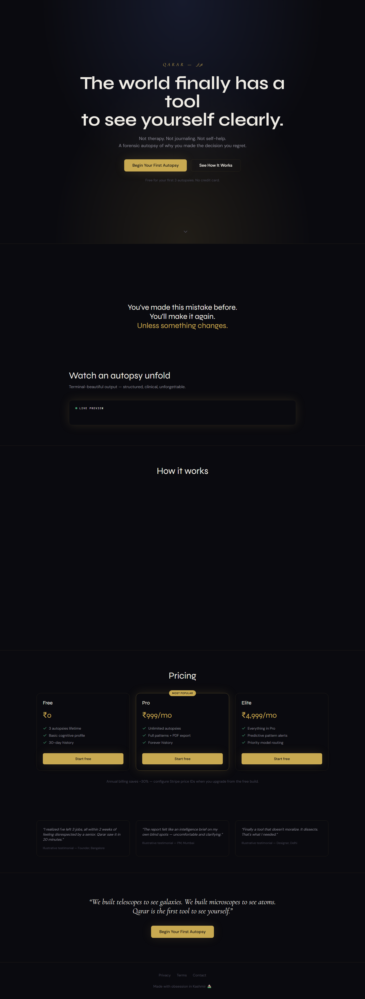
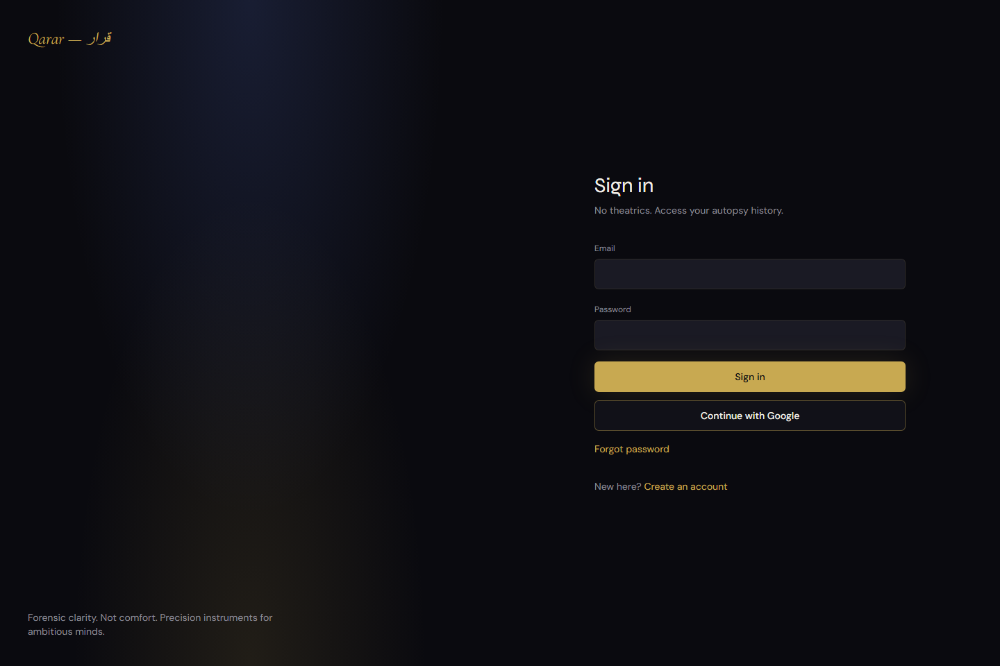
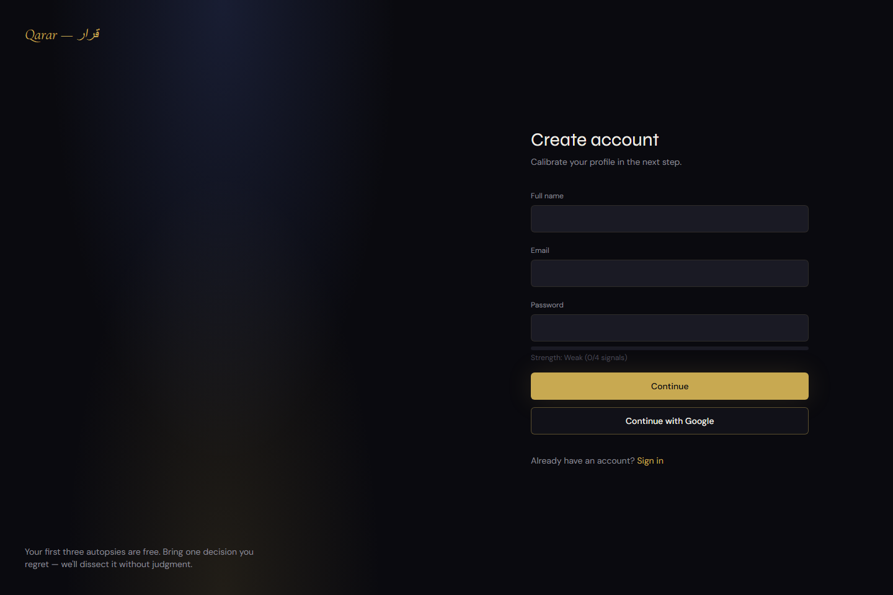

# Qarar AI

**Decision intelligence for forensic self-analysis** — structured AI autopsies of past decisions, longitudinal cognitive profiling, and plan-based access to deeper pattern intelligence.


---

## Table of contents

1. [Overview](#overview)
2. [Product capabilities](#product-capabilities)
3. [Plans and entitlements](#plans-and-entitlements)
4. [Architecture](#architecture)
5. [Tech stack](#tech-stack)
6. [Getting started](#getting-started)
7. [Environment variables](#environment-variables)
8. [Database](#database)
9. [API surface](#api-surface)
10. [Testing and quality](#testing-and-quality)
11. [AI safety and reliability](#ai-safety-and-reliability)
12. [Privacy and secrets handling](#privacy-and-secrets-handling)
13. [Deployment](#deployment)
14. [UI reference captures](#ui-reference-captures)

---

## Overview

Qarar helps users **analyze regretted decisions** with a consistent forensic framework: root causes, cognitive biases, triggers, and actionable reframes. Over time, the product aggregates outcomes into a **cognitive profile** and, on paid tiers, unlocks **pattern views**, **PDF export**, and (Elite) **pattern alerts** when recurring biases are detected.

The application is built as a **Next.js 14** (App Router) monolith with **Supabase** for auth and data, **Google Gemini** for structured analysis, and **Stripe** for subscriptions and the customer billing portal.
Recent hardening also adds request validation, endpoint rate limiting, prompt-isolation controls, output safety checks, and inference telemetry for better production reliability.

---

## Product capabilities

| Area | Description |
|------|-------------|
| **Decision autopsy** | Guided flow producing structured analysis (biases, triggers, lessons) stored per user. |
| **Dashboard** | Summary metrics; uses stored domain scores and monthly quality trend when available. |
| **History** | List of past autopsies; **Free** tier is limited to a rolling **30-day** window in the UI. |
| **Patterns** | Deeper visualization of domains and biases; **Pro+** only. |
| **Cognitive profile** | Aggregated from decisions; enriched with domain scores and trend data from analysis pipeline. |
| **PDF export** | Client-side export via `jspdf`; **Pro+** only. |
| **Upgrade UX** | Modal and upgrade page when limits are hit; Stripe Checkout with plan metadata. |
| **Billing** | Stripe Checkout, **Billing Portal** for subscribers, webhooks for plan sync. |
| **Onboarding** | Captures calibration answers; persisted when profile columns exist (see [Database](#database)). |
| **Profile** | Notification preferences, **danger zone** (clear history, delete account) via authenticated APIs. |
| **Operations** | `/api/health` (dependency checks), `/api/ready` (readiness for load balancers). |

---

## Plans and entitlements

Entitlements are centralized in `src/lib/plan-limits.ts` and enforced in UI and server routes.

| Feature | Free | Pro | Elite |
|--------|:----:|:---:|:-----:|
| Lifetime autopsies (cap) | 3 | Unlimited | Unlimited |
| History window | Last 30 days | Full | Full |
| Patterns | No | Yes | Yes |
| PDF export | No | Yes | Yes |
| Cognitive profile depth | Basic | Full | Full |
| Pattern alerts (recurring bias signals) | No | No | Yes |

Stripe webhook and checkout flows map purchases to `user_profiles.plan` (`free` | `pro` | `elite`).

---

## Architecture

- **Frontend**: React 18, App Router, Tailwind, Radix-based UI primitives, Framer Motion, Recharts.
- **Auth**: Supabase Auth; middleware protects app routes; callback at `/auth/callback`.
- **Data**: PostgreSQL via Supabase with Row Level Security (RLS) on user-scoped tables.
- **AI**: Gemini generates JSON-structured autopsy output; prompts and parsing live under `src/lib` and API routes.
- **Payments**: Stripe Checkout (with `client_reference_id` and metadata), Billing Portal session, webhooks for subscription lifecycle and failed payments (optional Resend email).

---

## Tech stack

| Layer | Choices |
|-------|---------|
| Framework | Next.js 14 (App Router), TypeScript |
| Styling | Tailwind CSS, CVA, `tailwind-merge` |
| UI | Radix UI, Lucide icons |
| State | Zustand (where used) |
| Validation | Zod |
| AI | `@google/generative-ai` (Gemini) |
| Backend data | `@supabase/supabase-js`, `@supabase/ssr` |
| Payments | `stripe` |
| Email | `resend` (optional, e.g. payment failure notices) |
| PDF | `jspdf` |
| Tests | Vitest, Testing Library, Playwright |
| CI | GitHub Actions (`.github/workflows/ci.yml`) |

---

## Getting started

### Prerequisites

- Node.js 18+ (LTS recommended)
- npm
- Supabase project (Auth + Postgres)
- Google AI Studio API key for Gemini
- Optional: Stripe account and Resend account for billing and mail

### Install

```bash
git clone <repository-url>
cd Qarar-AI
npm install
```

### Configure environment

```bash
cp .env.example .env.local
```

Edit `.env.local` with your keys (see [Environment variables](#environment-variables)).

### Run locally

```bash
npm run dev
```

Open [http://localhost:3000](http://localhost:3000).

### Production build (local verification)

```bash
npm run build
npm start
```

---

## Environment variables

Copy from `.env.example` and set values in `.env.local` (never commit secrets).

### Required for core product behavior

| Variable | Purpose |
|----------|---------|
| `NEXT_PUBLIC_APP_URL` | Canonical app URL (e.g. `http://localhost:3000`) |
| `NEXT_PUBLIC_SUPABASE_URL` | Supabase project URL |
| `NEXT_PUBLIC_SUPABASE_ANON_KEY` | Supabase anonymous key (client) |
| `GEMINI_API_KEY` | Google Gemini API access |

### Recommended for server features

| Variable | Purpose |
|----------|---------|
| `SUPABASE_SERVICE_ROLE_KEY` | Server-only key for admin operations (webhooks, deletes, elevated reads) — **keep secret** |
| `GEMINI_MODEL` | Optional model override (default is a fast JSON-capable model, e.g. `gemini-2.0-flash`) |

### Stripe (billing)

| Variable | Purpose |
|----------|---------|
| `STRIPE_SECRET_KEY` | Stripe secret API key |
| `STRIPE_WEBHOOK_SECRET` | Verifies `/api/stripe/webhook` signatures |
| `NEXT_PUBLIC_STRIPE_PUBLISHABLE_KEY` | Publishable key for Checkout |
| `NEXT_PUBLIC_STRIPE_PRICE_PRO_MONTHLY` | Price ID for Pro |
| `NEXT_PUBLIC_STRIPE_PRICE_ELITE_MONTHLY` | Price ID for Elite |

### Email (optional)

| Variable | Purpose |
|----------|---------|
| `RESEND_API_KEY` | Resend API key |
| `RESEND_FROM_EMAIL` | Verified sender address in Resend (e.g. `notifications@yourdomain.com`) |

---

## Database

1. In the Supabase SQL editor, run **`supabase/schema.sql`** to create tables, policies, and core objects.
2. Run **`supabase/migrations/002_profile_extensions.sql`** to add profile fields used by onboarding and notification settings (`onboarding_answers`, `notification_settings`).
3. Run **`supabase/migrations/003_autopsy_inference_metadata.sql`** to add AI traceability columns (`prompt_version`, `schema_version`, `request_id`, `latency_ms`) for reliability audits.
4. Run **`supabase/migrations/004_durable_ai_rate_limits.sql`** to enable durable AI route limits across serverless instances.

Enable **Email** auth (and optional OAuth) in Supabase. Set the redirect URL to match your app, for example:

`http://localhost:3000/auth/callback`

---

## API surface

| Method | Path | Role |
|--------|------|------|
| `POST` | `/api/autopsy/analyze` | Run Gemini autopsy; updates profile aggregates and Elite pattern alerts when applicable |
| `POST` | `/api/patterns/generate` | Refresh pattern narrative |
| `GET` | `/api/user/me` | Current user plan, limits, and related flags |
| `POST` | `/api/user/delete-history` | Delete user’s decision history (authenticated, service role) |
| `POST` | `/api/user/delete-account` | Delete auth user (authenticated, service role) |
| `POST` | `/api/stripe/checkout` | Create Stripe Checkout session |
| `POST` | `/api/stripe/portal` | Create Stripe Billing Portal session |
| `POST` | `/api/stripe/webhook` | Stripe webhooks (subscriptions, checkout, invoice events) |
| `GET` | `/api/health` | Liveness/dependency status |
| `GET` | `/api/ready` | Readiness probe |

---

## Testing and quality

| Command | Description |
|---------|-------------|
| `npm run lint` | ESLint (Next.js config) |
| `npm run typecheck` | TypeScript compiler check (`tsc --noEmit`) |
| `npm run test` | Vitest with coverage |
| `npm run test:watch` | Vitest watch mode |
| `npm run test:e2e` | Playwright end-to-end tests |
| `npm run test:e2e:ui` | Playwright UI mode |
| `npm run test:all` | Lint, unit tests, and E2E in sequence |

---

## AI safety and reliability

- **Input validation**: `POST /api/autopsy/analyze` validates request payloads with Zod (`src/lib/api-validation.ts`).
- **Rate limiting**: AI routes enforce fixed-window request limits per user/IP key with Supabase-backed durable counters and local test/dev fallback (`src/lib/rate-limit.ts`).
- **Prompt hardening**: untrusted user/context data is explicitly delimited in prompts to reduce instruction hijack risk (`src/lib/gemini.ts`, `src/app/api/patterns/generate/route.ts`).
- **Timeouts and error taxonomy**: inference paths distinguish timeout/provider/parse/validation errors and return structured failure responses.
- **Safety checks**: user input is screened for crisis/self-harm patterns before inference, and generated autopsy advice passes a high-risk content guard before persistence (`src/lib/llm-safety.ts`).
- **Telemetry**: structured inference logs include request ID, model version, prompt/schema version, latency, token usage (`src/lib/inference-telemetry.ts`).
- **Security headers**: baseline CSP, frame, referrer, MIME, and permissions headers are configured in `next.config.mjs`.

---

## Privacy and secrets handling

- Never commit `.env`, `.env.local`, or any credentials file.
- Keep `SUPABASE_SERVICE_ROLE_KEY`, `GEMINI_API_KEY`, and `STRIPE_SECRET_KEY` server-only.
- Do not log raw secrets, tokens, or webhook signatures.
- Review `.gitignore` before adding new tooling so generated secret-bearing files stay untracked.
- Rotate keys immediately if a secret is accidentally exposed.

---

## Deployment

- **Hosting**: Compatible with Vercel or any Node host that supports Next.js 14.
- **Environment**: Set all variables from [Environment variables](#environment-variables) in the host dashboard.
- **Stripe**: Create a webhook endpoint pointing to `https://<your-domain>/api/stripe/webhook` and subscribe at minimum to events you handle (e.g. `checkout.session.completed`, `customer.subscription.updated`, `customer.subscription.deleted`, `invoice.payment_failed`).
- **Probes**: Use `/api/ready` for readiness and `/api/health` for deeper dependency checks.
- **Migrations**: apply `schema.sql` and all migrations in order (`002`, `003`, `004`) before promoting.

---

## UI reference captures

Screenshots are generated for documentation consistency:

```bash
npm run capture:ui
```

Output directory: `public/screenshots/`. Commit the generated PNGs if you want them to render on GitHub; otherwise run the script locally before reviewing docs.

| Screen | Preview |
|--------|---------|
| Landing |  |
| Login |  |
| Signup |  |
| Onboarding |  |

---

## Repository layout (high level)

| Path | Contents |
|------|----------|
| `src/app/` | App Router pages and API routes |
| `src/components/` | UI components and feature clients |
| `src/lib/` | Domain logic, Stripe, Gemini, PDF, email helpers |
| `supabase/` | Schema and migrations |
| `tests/` | Vitest specs |
| `tests/e2e/` | Playwright specs |

---

*This README reflects the application as of the current main branch. For schema changes, always apply migrations in order after `schema.sql`.*
