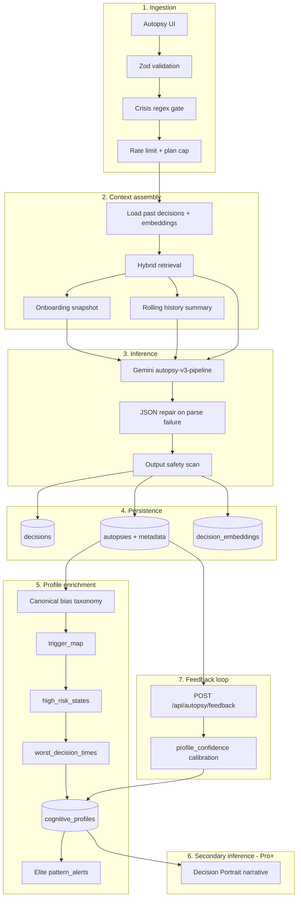

# Qarar AI

**Decision intelligence for forensic self-analysis** — structured AI autopsies of regretted decisions, longitudinal cognitive profiling, and plan-gated pattern intelligence.


---

## Table of contents

1. [Overview](#overview)
2. [Product capabilities](#product-capabilities)
3. [Plans and entitlements](#plans-and-entitlements)
4. [AI pipeline](#ai-pipeline)
5. [Architecture](#architecture)
6. [Tech stack](#tech-stack)
7. [Getting started](#getting-started)
8. [Environment variables](#environment-variables)
9. [Database](#database)
10. [API surface](#api-surface)
11. [Testing and quality](#testing-and-quality)
12. [AI safety and reliability](#ai-safety-and-reliability)
13. [Privacy and secrets](#privacy-and-secrets)
14. [Deployment](#deployment)
15. [Repository layout](#repository-layout)

---

## Overview

Qarar helps users analyze **regretted decisions** with a consistent forensic framework: root causes, cognitive biases, emotional triggers, calibrated probabilities, and actionable reframes. Each autopsy feeds a **cognitive profile** that improves over time through retrieval, aggregation, and user feedback.

The product is a **Next.js 14** (App Router) application backed by **Supabase** (auth + Postgres + RLS), **Google Gemini** (structured inference + embeddings), and **Stripe** (subscriptions). Production controls include Zod validation, durable rate limits, prompt isolation, crisis screening, output safety guards, and structured inference telemetry.

**Design system:** Cinzel (royal headings), Cormorant Garamond (display), Lora (body), JetBrains Mono (data) on a dark gold/neural palette — applied via `MarketingShell`, `AuthShell`, `PageHeader`, and `src/components/royal/*`.

---

## Product capabilities

| Area | Description |
|------|-------------|
| **Decision autopsy** | Guided narrative input → full pipeline → structured JSON report + markdown autopsy |
| **Onboarding** | Calibration (regrets, weakness, motivation) wired into first autopsy context |
| **Dashboard** | Stats, recent autopsies, bias/domain charts, pattern alerts (mark read), quality trend |
| **History** | Searchable, filterable decision list; Free tier limited to 30-day window |
| **Patterns** | Pro+ — bias charts, domain radar, trigger map, high-risk states, worst decision times, AI portrait |
| **Cognitive profile** | Aggregated biases, domains, trends, confidence (feedback-aware), history summary |
| **Feedback loop** | Thumbs up/down per autopsy; influences `profile_confidence` |
| **PDF export** | Client-side via `jspdf`; Pro+ |
| **Billing** | Stripe Checkout, Billing Portal, webhooks → `user_profiles.plan` |
| **Profile** | Account, notifications, JSON export, delete history/account |
| **Operations** | `/api/health`, `/api/ready` for probes |

---

## Plans and entitlements

Enforced in `src/lib/plan-limits.ts` (UI + API).

| Feature | Free | Pro | Elite |
|--------|:----:|:---:|:-----:|
| Lifetime autopsies | 3 | Unlimited | Unlimited |
| History window | 30 days | Full | Full |
| Patterns & PDF | — | Yes | Yes |
| Pattern alerts | — | — | Yes |
| Cognitive profile | Basic | Full | Full |

---

## AI pipeline

**Version:** `pipeline-v1-2026-05-23` · **Orchestrator:** `src/lib/pipeline/orchestrator.ts`

### End-to-end flow



### Stage reference

| Stage | Module(s) | Behavior |
|-------|-----------|----------|
| **Validation** | `api-validation.ts`, `analyze/route.ts` | Zod on input; 10 autopsies/hour/user; plan lifetime caps |
| **Crisis gate** | `llm-safety.ts` | Blocks self-harm/crisis narratives before any LLM call (422) |
| **Hybrid retrieval** | `context.ts`, `embeddings.ts`, `text-similarity.ts` | **embedding** (Gemini `text-embedding-004`) → **text** (TF-IDF cosine) → **recency** fallback; top-k relevant past decisions |
| **Context injection** | `summary.ts`, `gemini.ts` | Rolling history summary, onboarding answers, cognitive profile snapshot, untrusted-data delimiters |
| **Primary inference** | `gemini.ts` | `autopsy-v3-pipeline-2026-05-23`; JSON mode; temp 0.65; 45s timeout; 1 retry |
| **Parse repair** | `gemini.ts` | One-shot JSON repair if schema validation fails |
| **Output safety** | `llm-safety.ts` | Regex guard on generated advice before save |
| **Persistence** | `analyze/route.ts` | `decisions`, `autopsies` (prompt/schema/request_id/latency/pipeline_version/retrieval_method), `decision_embeddings` |
| **Profile enrichment** | `profile-enrichment.ts`, `cognitive-aggregate.ts` | `top_biases`, `trigger_map`, `high_risk_states`, `worst_decision_times`, domain scores, monthly quality trend, `profile_confidence` |
| **Feedback** | `feedback/route.ts`, orchestrator | Helpful rate adjusts confidence on next aggregate |
| **Patterns** | `gemini-patterns.ts` | Decision Portrait with system prompt + output safety |
| **Telemetry** | `inference-telemetry.ts` | Structured JSON logs per request |
| **Evaluation** | `eval/rubric.ts`, `eval/golden-cases.ts` | Rubric scorer + 5 golden cases in Vitest |

### Retrieval methods

Stored on each autopsy as `retrieval_method`:

| Method | When used |
|--------|-----------|
| `embedding` | Query + past decision embeddings available (cosine similarity) |
| `text` | No embeddings; TF-IDF similarity above threshold |
| `recency` | Cold start or low similarity — most recent decisions |

### API response (autopsy)

Successful `POST /api/autopsy/analyze` returns structured `result`, `decision_id`, `autopsy_id`, `safety_disclaimer`, and:

```json
{
  "pipeline": {
    "version": "pipeline-v1-2026-05-23",
    "retrieval_method": "embedding",
    "relevant_decisions_count": 3
  }
}
```

---

## Architecture

| Layer | Implementation |
|-------|----------------|
| **Frontend** | React 18, App Router, Tailwind, Radix UI, Framer Motion, Recharts |
| **Layouts** | `MarketingShell` (public), `AuthShell` (login/signup), `AppShell` (authenticated) |
| **Auth** | Supabase Auth; middleware; `/auth/callback` |
| **Data** | PostgreSQL + RLS; service role for webhooks and destructive ops |
| **AI** | Gemini Flash (autopsy JSON) + text-embedding-004 (retrieval) |
| **Payments** | Stripe Checkout, Portal, webhooks |
| **CI** | GitHub Actions — lint, typecheck, Vitest, Playwright |

---

## Tech stack

| Layer | Choices |
|-------|---------|
| Framework | Next.js 14 (App Router), TypeScript |
| Styling | Tailwind CSS, CSS variables, CVA |
| Fonts | Cinzel, Cormorant Garamond, Lora, JetBrains Mono |
| Validation | Zod |
| AI | `@google/generative-ai` |
| Data | `@supabase/supabase-js`, `@supabase/ssr` |
| Payments | Stripe |
| Email | Resend (optional) |
| PDF | jspdf |
| Tests | Vitest, Testing Library, Playwright |

---

## Getting started

### Prerequisites

- Node.js 18+
- Supabase project (Auth + Postgres)
- Google AI Studio API key (Gemini)
- Optional: Stripe, Resend

### Install and run

```bash
git clone <repository-url>
cd Qarar-AI
npm install
cp .env.example .env.local
# Edit .env.local — see Environment variables
npm run dev
```

Open [http://localhost:3000](http://localhost:3000).

### Verify production build

```bash
npm run build
npm start
```

### Optional UI captures

Generate reference screenshots locally (not required for the app to run):

```bash
npm run capture:ui
```

Output: `public/screenshots/` (PNG files are gitignored; use locally or for docs).

---

## Environment variables

Set in `.env.local` (never commit secrets). See `.env.example`.

| Variable | Required | Purpose |
|----------|:--------:|---------|
| `NEXT_PUBLIC_APP_URL` | Yes | Canonical URL |
| `NEXT_PUBLIC_SUPABASE_URL` | Yes | Supabase project URL |
| `NEXT_PUBLIC_SUPABASE_ANON_KEY` | Yes | Client anon key |
| `GEMINI_API_KEY` | Yes | Gemini inference + embeddings |
| `SUPABASE_SERVICE_ROLE_KEY` | Recommended | Webhooks, account/history delete |
| `GEMINI_MODEL` | Optional | Default `gemini-2.0-flash` |
| `STRIPE_*` | Billing | Secret key, webhook secret, publishable key, price IDs |
| `RESEND_*` | Optional | Payment failure emails |

---

## Database

Apply in order in the Supabase SQL editor:

| Order | File | Purpose |
|-------|------|---------|
| 1 | `supabase/schema.sql` | Core tables, RLS, rate-limit RPC |
| 2 | `supabase/migrations/002_profile_extensions.sql` | Onboarding + notification settings |
| 3 | `supabase/migrations/003_autopsy_inference_metadata.sql` | Prompt/schema version, request_id, latency |
| 4 | `supabase/migrations/004_durable_ai_rate_limits.sql` | Cross-instance AI rate limits |
| 5 | `supabase/migrations/005_pipeline_extensions.sql` | Feedback, embeddings, profile enrichment columns |

**Auth redirect URL:** `http://localhost:3000/auth/callback` (adjust for production).

### Key tables

| Table | Role |
|-------|------|
| `decisions` | User narratives, domain, outcome ratings |
| `autopsies` | Structured AI output + inference metadata |
| `decision_embeddings` | JSON embedding vectors for retrieval |
| `cognitive_profiles` | Aggregates, trigger map, trends, portrait |
| `autopsy_feedback` | Helpful/not-helpful per autopsy |
| `pattern_alerts` | Elite recurring-bias notifications |
| `ai_rate_limits` | Durable rate-limit counters |

---

## API surface

| Method | Path | Description |
|--------|------|-------------|
| `POST` | `/api/autopsy/analyze` | Full autopsy pipeline |
| `POST` | `/api/autopsy/feedback` | Record autopsy feedback |
| `POST` | `/api/patterns/generate` | Regenerate Decision Portrait (Pro+) |
| `GET` | `/api/user/me` | Plan, limits, flags |
| `POST` | `/api/user/delete-history` | Wipe decision history |
| `POST` | `/api/user/delete-account` | Delete account |
| `POST` | `/api/stripe/checkout` | Checkout session |
| `POST` | `/api/stripe/portal` | Billing portal |
| `POST` | `/api/stripe/webhook` | Subscription sync |
| `GET` | `/api/health` | Dependency health |
| `GET` | `/api/ready` | Readiness probe |

---

## Testing and quality

| Command | Description |
|---------|-------------|
| `npm run lint` | ESLint |
| `npm run typecheck` | `tsc --noEmit` |
| `npm run test` | Vitest + coverage (pipeline, rubric, hardening) |
| `npm run test:e2e` | Playwright smoke tests |
| `npm run test:all` | Lint + unit + E2E |

**Eval assets:** `src/lib/eval/golden-cases.ts`, `src/lib/eval/rubric.ts`, `tests/pipeline.test.ts`.

---

## AI safety and reliability

- **Input validation** — Zod schemas for autopsy and feedback payloads
- **Rate limiting** — Supabase-backed fixed windows (`autopsy-analyze`: 10/hr, `patterns-generate`: 6/hr)
- **Prompt isolation** — Untrusted delimiters; system instructions immutable
- **Crisis screening** — Pre-inference block with safe messaging (422)
- **Output guards** — High-risk advice patterns rejected before persistence
- **Error taxonomy** — `timeout`, `parse_error`, `provider_error`, `validation_error`, `rate_limited`
- **Traceability** — `prompt_version`, `schema_version`, `request_id`, `latency_ms`, `pipeline_version`, `retrieval_method` on autopsies
- **Security headers** — CSP and related headers in `next.config.mjs`

---

## Privacy and secrets

- Do not commit `.env`, `.env.local`, or credential files
- Keep `SUPABASE_SERVICE_ROLE_KEY`, `GEMINI_API_KEY`, and `STRIPE_SECRET_KEY` server-only
- Users can export JSON or delete history/account from Settings
- Crisis content is not sent to the model
- Replace placeholder copy on `/about` with counsel-reviewed policies before public launch

---

## Deployment

See **[DEPLOYMENT.md](./DEPLOYMENT.md)** for the full production checklist (env vars, Stripe webhook, Supabase auth URLs, probes).

1. Apply all database migrations (`schema.sql` + `002`–`005`)
2. Set environment variables on the host (Vercel or Node 18+)
3. Configure Stripe webhook → `https://<domain>/api/stripe/webhook`
4. Set Supabase redirect URLs for production
5. Use `/api/ready` (readiness) and `/api/health` (dependencies)

---

## Repository layout

```
src/
├── app/                    # App Router pages + API routes
├── components/
│   ├── layout/             # MarketingShell, AuthShell, AppShell, PageHeader
│   ├── patterns/           # Patterns client (real pipeline data)
│   ├── dashboard/          # Pattern alerts panel
│   ├── royal/              # Crest, cards, ambient backgrounds
│   └── ui/                 # Button, Card, Input, Textarea, Select, …
├── lib/
│   ├── pipeline/           # Orchestrator, retrieval, enrichment
│   ├── eval/               # Golden cases + rubric scorer
│   ├── gemini.ts           # Primary autopsy inference
│   ├── gemini-patterns.ts  # Decision Portrait
│   └── …                   # Stripe, safety, telemetry, plan limits
supabase/
├── schema.sql
└── migrations/002–005
tests/                        # Vitest + Playwright
```

---

*README reflects the current main branch. Always run migrations in order after `schema.sql`.*
